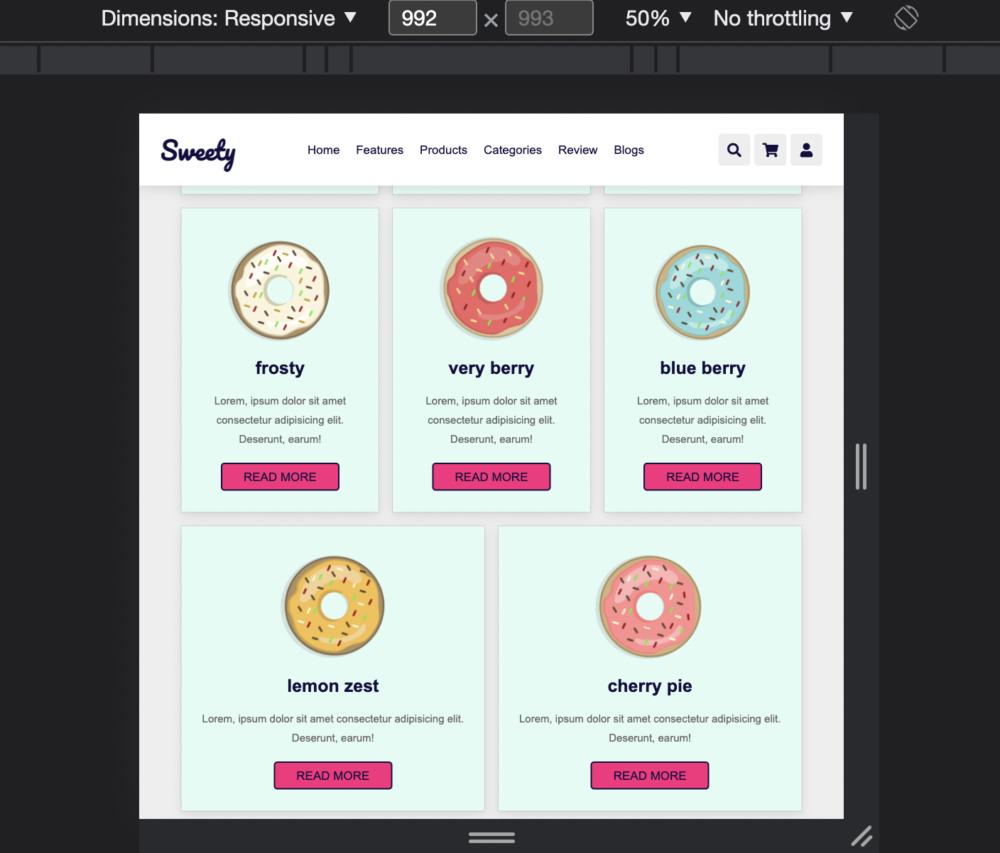

# sweety-layout

- Take a look at the screenshots in the design folder
- Create a responsive page based on the screenshots using flex and media queries

Notice:

- Use custom properties
- Use semantic tags (`header`, `main`, `nav`, `footer` etc.)
- Navigation should stay put while scrolling.
- Navigation links should be hidden on mobile.
- Make sure you show the burger icon on mobile ( no functionality ).
- Menu links should have a deep pink underline on hover
- Icons should have a deep pink background on hover

```css
  --highlight: #fe217d;
  --black: #130f40;
  --light-color: #666;
  --box-shadow: 0 0.5rem 1.5rem rgba(0, 0, 0, 0.1);
  --border: 0.2rem solid rgba(0, 0, 0, 0.1);
  --outline: 0.1rem solid rgba(0, 0, 0, 0.1);
  --outline-hover: 0.2rem solid var(--black);
--font-serif Arial, Helvetica, sans-serif;
--font-cursive 'Pacifico', cursive;

--screen-m 768px
--screen-l 992px

```

## Demo

https://user-images.githubusercontent.com/82094277/199498935-489679f7-409b-4380-9a46-14942342b30d.mov

## Tablet


## Desktop




## Extra


